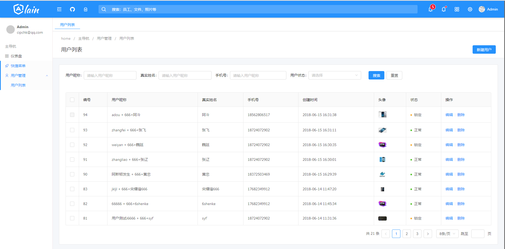
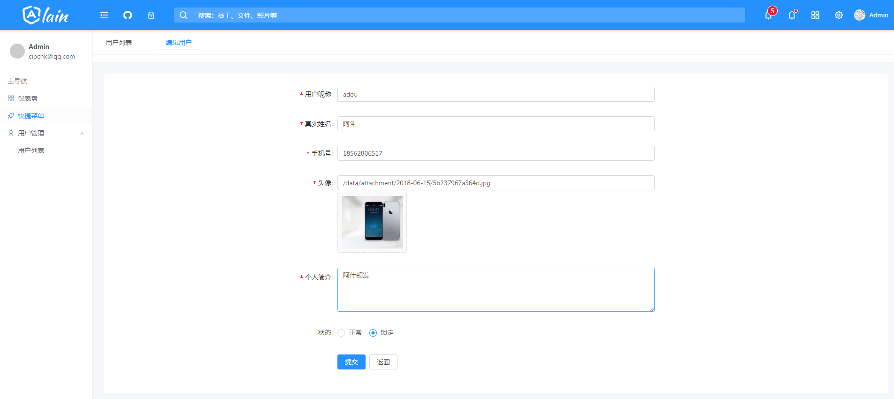

[](https://travis-ci.org/cipchk/ng-alain)
[](https://david-dm.org/cipchk/ng-alain)
[](https://www.npmjs.com/package/ng-alain)
[](https://www.npmjs.com/package/ng-alain)
[](https://prettier.io/)
# angular6-admin
最新版的angular 增删改查，UI为蚂蚁金服ng-alain,ant-zorro 框架

# ng-alain

[Ng-zorro-antd](https://github.com/NG-ZORRO/ng-zorro-antd) admin panel front-end framework.

更多信息见[中文 README](README-zh_CN.md)

[DEMO](https://cipchk.github.io/ng-alain/)

## Quick start

There are two ways to install:

### Use the Command Line

```bash
ng new demo --style less
cd demo
ng add ng-alain
ng serve
```

Please refer to [Cli] (http://ng-alain.com/cli) for more details.

### Clone the Git Repository

```bash
# --depth 1 removes all but one .git commit history
$ git clone --depth=1 https://github.com/cipchk/ng-alain.git my-project

# change directory
cd my-project

# install npm package
npm install

# start the serve
npm start

# use HMR
npm run serve:hmr
```

> [vscode] recommended install [ng-zorro-vscode](https://marketplace.visualstudio.com/items?itemName=cipchk.ng-zorro-vscode) plugins, that includes `nz-alain-*` snippets.

## Links

+ [Document](http://ng-alain.com)
+ [@delon](https://github.com/cipchk/delon)
+ [DEMO](https://cipchk.github.io/ng-alain/)


## Features

+ `ng-zorro-antd` based
+ Responsive Layout
+ I18n
+ [@delon](https://github.com/cipchk/delon)
+ Lazy load Assets
+ UI Router States
+ Customize Theme
+ Less preprocessor
+ Well organized & commented code
+ Simple upgrade
+ Support Docker deploy

### 用户列表


### 用户编辑


### License

The MIT License (see the [LICENSE](https://github.com/cipchk/ng-alain/blob/master/LICENSE) file for the full text)
